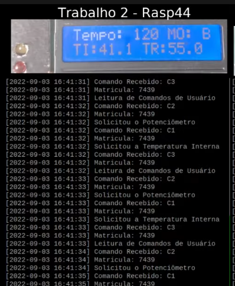
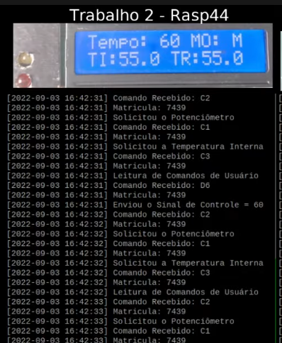

# Configurações básicas

<p>O arquivo "inc/definitions.h" possui todas as constantes utilizadas no trabalho. Caso seja necessário alterar alguma constante, basta editar esse arquivo.</p>

<p>Um exemplo é o nome do arquivo de log CSV. Sempre que o programa é executado ele é recriado para armazenar apenas os logs daquela execução. Se precisar manter algum log, basta alterar o nome da definição CSV\_FILE\_NAME.</p>

# Como executar o projeto

```
$ make
$ make run
```

# Detalhes do projeto

## Como a airfryer funciona

<p>Após iniciar a execução a airfryer espera o botão "Ligar" ser pressionado.</p>
<p>Com ela ligada, é o momento onde a configuração inicial de tempo e temperatura devem ser feitos (por padrão o mínimo é 60s).</p>
<p>Nesse momento de configuração inicial é o único momento em que o sistema de modos pode ser usado.</p>
<p>Após isso, basta clicar no botão "Iniciar".</p>
<p>Nesse momento, será feito o aquecimento para atingir a temperatura de referência. (Se o sistema já estiver acima dessa temperatura antes de iniciar, essa etapa é pulada)</p>
<p>Após o pré-aquecimento, inicia a operação programada. É possível alterar o tempo e a temperatura de refência durante essa etapa.</p>
<p>O comando de parar o sistema funciona por interrupção, pode ser acionado em qualquer momento. O sinal tratado é o SIGINT.</p>

## Sistema de modos (Menu)

<p>Existem 3 modos: 'M', 'A', 'B'.</p>
<p>O modo M é 100% manual.</p>
<p>O modo A é define o tempo como 180s.</p>
<p>O modo B é define o tempo como 120s.</p>

## Log CSV

<p>Só é logado as operações, ou seja, só é escrito o que ocorre entre o botão "Iniciar" ser clicado e o processo ser finalizado.</p>
<p>Sempre que um processo novo é iniciado, o log sobrescreve os dados do processo anterior.</p>

# Imagens

Imagens de como funciona o sistema de modos.



