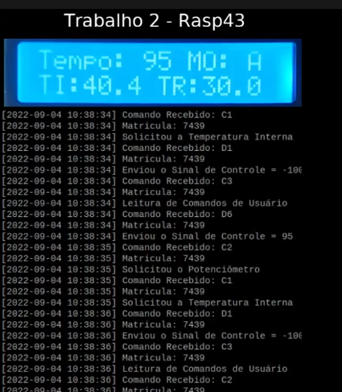

# Airfryer

Experimento do sistema no ThingsBoard:


- [ Enunciado original. ](#1)
- [ Configurações básicas. ](#2)
- [ Como executar o projeto. ](#3)
- [ Detalhes do projeto ](#4)
  - [ Como a airfryer funciona ](#5)
  - [ Sistema de modos (Menu) ](#6)
- [ Log CSV ](#7)
- [ Display LCD ](#8)
- [ Experimentos ](#9)

<a name="1"></a>
# Enunciado original

https://gitlab.com/fse_fga/trabalhos-2022_1/trabalho-2-2022-1

<a name="2"></a>
# Configurações básicas

<p>O arquivo "inc/definitions.h" possui todas as constantes utilizadas no trabalho. Caso seja necessário alterar alguma constante, basta editar esse arquivo.</p>

<p>Constantes não descritas no enunciado original:</p>

- ACCEPTABLE\_ERROR: define qual o nível aceitável de temperatura para pausar o sistema.
- TIME\_MIN: é o tempo mínimo que será usado nos processos, não é possível iniciar um processo com tempo menor do que esse.
- CSV\_FILE\_NAME: nome do arquivo onde ficará salvo os logs.
- I2C\_FILE: arquivo usado para a leitura da temperatura ambiente.

<a name="3"></a>
# Como executar o projeto

```
$ make
$ make run
$ make clean # remover arquivos gerados
```

Foi utilizado as seguintes bibliotecas para GPIO e I2C:
- wiringPi;
- wiringPiI2C;
- softPwm;

<a name="4"></a>
# Detalhes do projeto

<a name="5"></a>
## Como a airfryer funciona

<p>Após iniciar a execução, a airfryer espera o botão "Ligar" ser pressionado.</p>
<p>Com ela ligada, é o momento onde a configuração inicial de tempo e temperatura devem ser feitos (por padrão o tempo mínimo é 60s, definido pela constante TIME_MIN).</p>
<p>O momento de configuração inicial é o único momento em que o sistema de modos pode ser usado.</p>
<p>Após isso, basta clicar no botão "Iniciar".</p>
<p>Nesse momento, será feito o aquecimento para atingir a temperatura de referência. (Se o sistema já estiver acima dessa temperatura antes de iniciar, essa etapa é pulada)</p>
<p>Após o pré-aquecimento, inicia a operação programada. É possível alterar o tempo e a temperatura de refência durante essa etapa.</p>
<p>O comando de parar o sistema funciona por interrupção, pode ser acionado em qualquer momento. O sinal tratado é o SIGINT.</p>
<p>Ao parar, o sistema retorna a temperatura ambiente.</p>

<a name="6"></a>
## Sistema de modos (Menu)

<p>Existem 3 modos: 'M', 'A', 'B'.</p>

- O modo M é 100% manual.
- O modo A é um alimento genério que define o tempo como 180s.
- O modo B é um alimento genério que define o tempo como 120s.

<a name="7"></a>
## Log CSV

<p>Só é logado as operações, ou seja, só é escrito o que ocorre entre o botão "Iniciar" ser clicado e o processo ser finalizado.</p>
<p>Exemplo de log:</p>

```
Dia,Mês,Ano,Hora,Minuto,Segundo,TI,TR,Sinal de Controle
04,08,2022,15,02,11,28.3,30.0,24.7,100.0
04,08,2022,15,02,14,28.5,30.0,24.7,60.3
04,08,2022,15,02,17,28.6,30.0,24.7,57.1
04,08,2022,15,02,20,28.9,30.0,24.7,0.1
04,08,2022,15,02,23,29.1,30.0,24.7,-30.1
04,08,2022,15,02,27,29.2,30.0,24.7,41.4
04,08,2022,15,02,30,29.3,30.0,24.7,38.0
04,08,2022,15,02,33,29.4,30.0,24.7,34.4
04,08,2022,15,02,36,29.6,30.0,24.7,4.0
04,08,2022,15,02,39,29.8,30.0,24.7,-24.6
04,08,2022,15,02,42,29.8,30.0,24.7,25.4
04,08,2022,15,02,45,29.9,30.0,24.7,21.8
04,08,2022,15,02,48,29.9,30.0,24.7,19.9
04,08,2022,15,02,52,30.1,30.0,24.7,-8.9
04,08,2022,15,02,55,30.1,30.0,24.7,-10.8
04,08,2022,15,02,58,30.2,30.0,24.7,-12.7
04,08,2022,15,03,01,30.3,30.0,24.7,8.4
04,08,2022,15,03,04,30.3,30.0,24.7,8.3
04,08,2022,15,03,07,30.4,30.0,24.7,-20.6
04,08,2022,15,03,10,30.4,30.0,24.7,4.2
04,08,2022,15,03,13,30.5,30.0,24.7,-22.9
```

<p>O exemplo acima não representa uma operação completa.</p>

<a name="8"></a>
## Display LCD

<p>O display LCD possui 5 campos: </p>
<ul>
  <li>Tempo: diminui conforme o tempo do processo passa (de 1 em 1 segundo);</li>
  <li>MO: qual modo foi selecionado;</li>
  <li>TI: temperatura interna;</li>
  <li>TR: temperatura de referência.</li>
  <li>TA: temperatura ambiente (só aparece durante o resfriamento).</li>
</ul>

<a name="9"></a>
# Experimentos

## Imagens de como funciona o sistema de modos.

<p>Clicando no botão "Menu", o campo "MO" alterna entre 'M', 'A' e 'B'. Alternando também o tempo para o tempo pré-definido.</p>


## Imagens de como funciona o sistema de pré-aquecimento.

<p>O sistema irá aquecer até que TI seja igual ou maior que TR.</p>


## Imagens de como funciona o sistema de resfriamento.

<p>O sistema irá resfriar até que TI seja igual ou menos que TA.</p>


## Relatório de Experimento

### ações

- Sistema ligado pressionando o botão "Ligar";
- Pressionado "Menu" até o alimento "A" estar definido;
- TR inicial definido como 40;
- TR reduzido para 30 no segundo 100;
- TR aumentado para 45 próximo do final da operação;
- Sistema desligado usando o botão "Desligar".

### imagens





